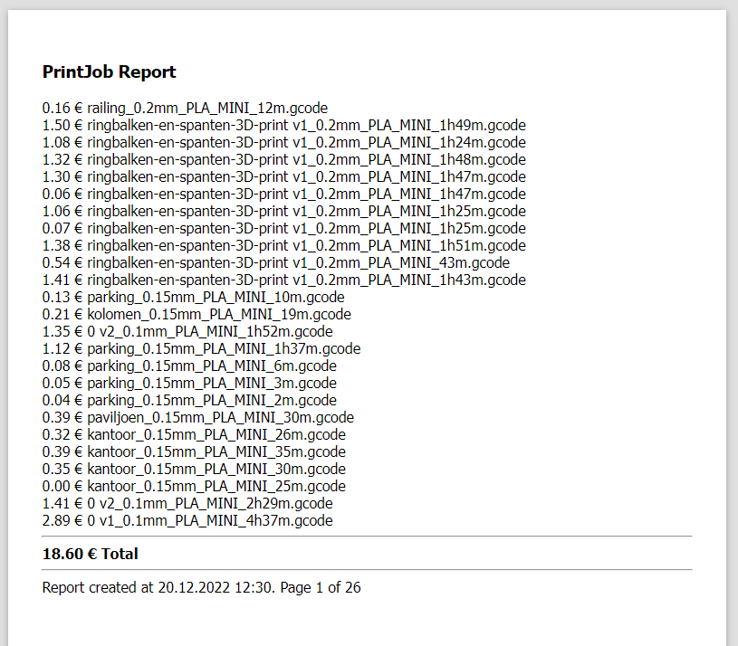
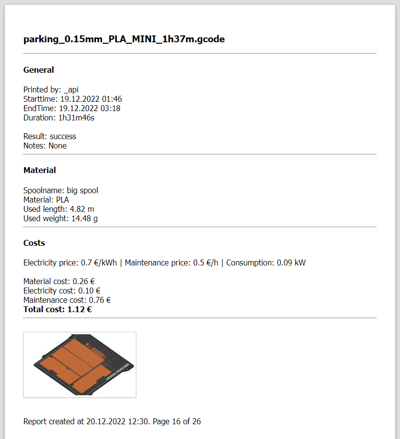

# PrintJobHistory Jinja Report Template for OctoPrint
An easy way to get the cost for a customer or for a little print job?

This template is designed to provide extended documentation for each print job, with an emphasis on material, maintenance, and electricity costs. With a front page including a summary of the total costs for all selected prints.

## Features
- Extended documentation for each print job, including price, material, maintenance and electricity costs.
- A front page with a summary of the total costs for all selected prints.
- Easy to use and integrate with OctoPrint.

This template is ideal for people who want a quick receipt when printing for someone, or for small printing farms looking to track their costs and expenses.

## Installation and Configuration
1. You can then customize the template to suit your needs by modifying the following lines:

~~~~html
	<!------------------------------------->
	{# set following parameters according to your printer and setup: #}
	 {# Wh #}
	 {# €/kWh #}
	 {# how much you ask per hour #}
	<!------------------------------------->
~~~~

2. Install the PrintJobHistory plugin for OctoPrint and upload the Jinja template in the report tab of the PrintJobHistory plugin settings. 

## Screenshots
### Front page report:

### Job page report:

## Support and Feedback
We hope you find this template useful, and please don't hesitate to reach out if you have any questions or suggestions for improvement. You can open an issue on this repository.

Happy printing!
___

> from [PrintJobHistory plugin](https://github.com/OllisGit/OctoPrint-PrintJobHistory/edit/master/README.md)
>
> template file based on [template file](https://github.com/OllisGit/OctoPrint-PrintJobHistory/blob/eb49a9547b7b885b9d3f46f9df37b9b582e08739/octoprint_PrintJobHistory/templates/PrintJobHistory_defaultMultiPrintJobReport.jinja2)
